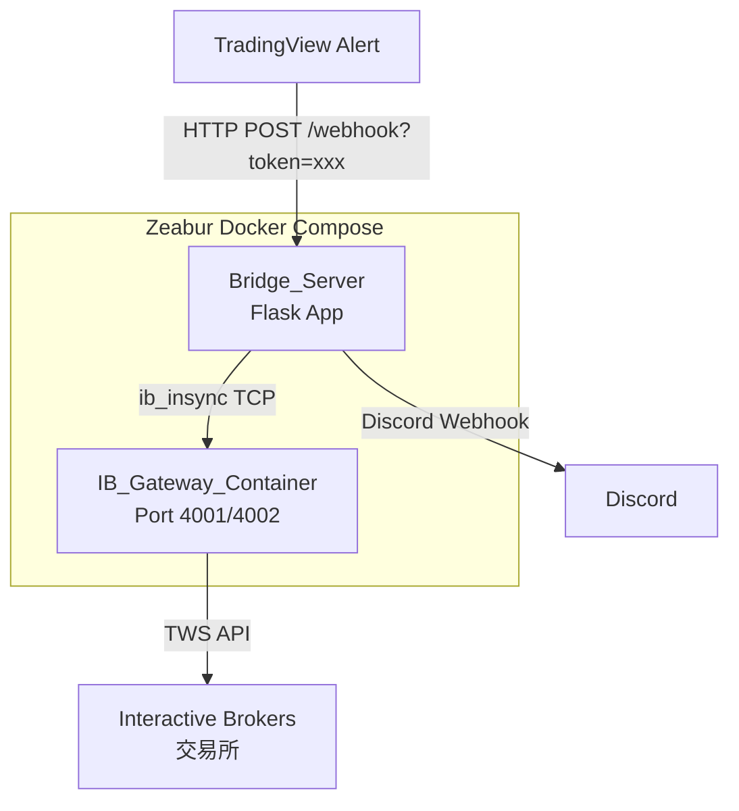
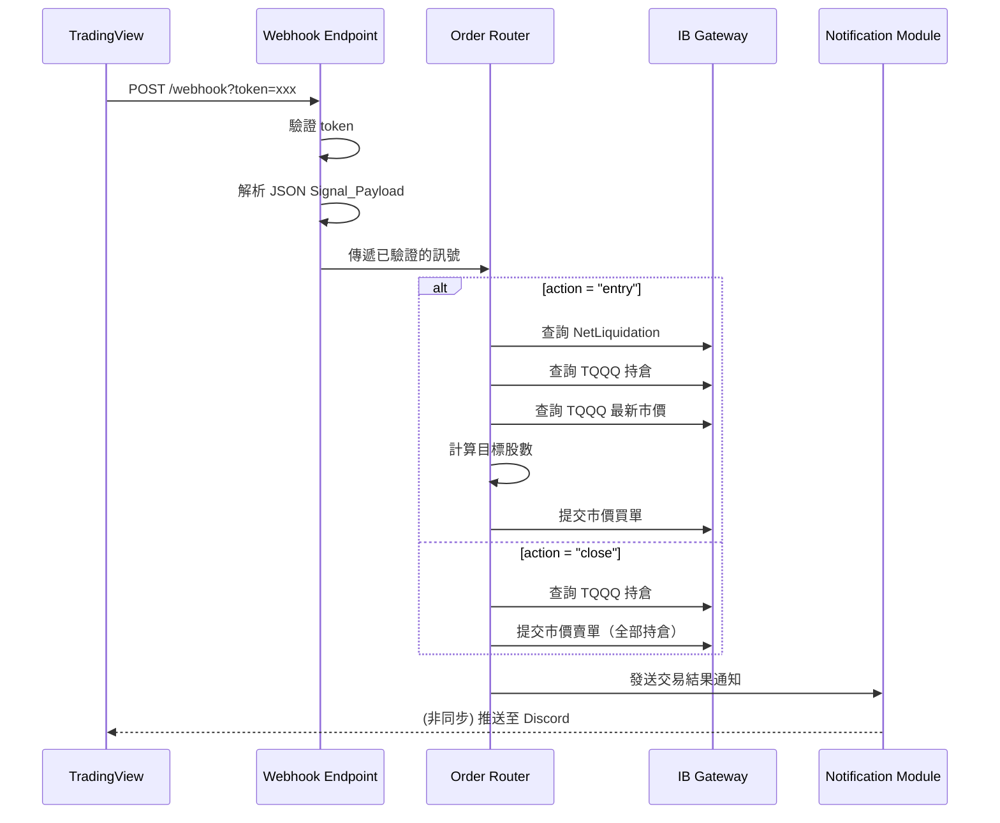

# 設計文件：TradingView-IBKR Bridge

## 概述 (Overview)

本系統為一個部署於 Zeabur 雲端平台的輕量級橋接服務，由兩個 Docker 容器組成：

1. **Bridge_Server**：Python Flask 應用程式，負責接收 TradingView Webhook 訊號、計算下單股數、透過 `ib_insync` 與 IB Gateway 溝通執行交易，並透過 Discord Webhook 發送通知。
2. **IB_Gateway_Container**：無頭 IB Gateway 容器（使用 `ghcr.io/extt/ib-gateway` 或 `voyz/ibeam`），維持與 Interactive Brokers 的加密連線。

系統僅支援 TQQQ 做多策略，訊號類型為「entry（滿倉進場）」與「close（全部平倉）」。使用 `nest_asyncio` 解決 Flask 同步框架與 `ib_insync` 非同步事件迴圈的相容性問題。

### 設計決策

- **Flask 而非 FastAPI**：TradingView Webhook 為低頻請求（每日數次），Flask 足夠且更簡單。使用 `nest_asyncio` 橋接非同步呼叫。
- **市價單 (Market Order)**：TQQQ 為高流動性 ETF，市價單可確保即時成交，避免限價單未成交的風險。
- **單一標的策略**：僅交易 TQQQ，簡化系統複雜度，無需多標的路由邏輯。
- **容器化 IB Gateway**：避免在 Zeabur 上安裝桌面環境，使用社群維護的無頭 Docker 映像檔。

## 架構 (Architecture)



### 請求處理流程



## 元件與介面 (Components and Interfaces)

### 1. Webhook Endpoint (`webhook.py`)

負責 HTTP 請求的接收、驗證與解析。

```python
# 介面定義
@app.route("/webhook", methods=["POST"])
def webhook_handler() -> tuple[dict, int]:
    """
    接收 TradingView Webhook 請求。
    - 從 URL query param 讀取 token 並驗證
    - 解析 JSON body 為 SignalPayload
    - 驗證必要欄位 (action, ticker)
    - 回傳 HTTP 200/400/403/503
    """
    ...
```

### 2. Order Router (`order_router.py`)

負責資金控管、持倉查詢與訂單執行。

```python
class OrderRouter:
    def __init__(self, ib_client: IB, config: Config):
        ...

    def handle_entry(self, signal: SignalPayload) -> OrderResult:
        """
        進場買入流程：
        1. 查詢 NetLiquidation
        2. 查詢目前 TQQQ 持倉
        3. 讀取 USE_EQUITY_PCT
        4. 取得 TQQQ 最新市價
        5. 計算目標股數 = floor(NetLiquidation × USE_EQUITY_PCT / 市價)
        6. 若差值 > 0，提交市價買單
        """
        ...

    def handle_close(self, signal: SignalPayload) -> OrderResult:
        """
        出場平倉流程：
        1. 查詢目前 TQQQ 持倉
        2. 若持倉 > 0，提交市價賣單（全部持倉）
        """
        ...

    def calculate_target_shares(
        self, net_liquidation: float, market_price: float, use_equity_pct: float
    ) -> int:
        """計算目標持有股數：floor(net_liquidation × use_equity_pct / market_price)"""
        ...
```

### 3. IB Connection Manager (`ib_manager.py`)

負責 IB Gateway 連線管理與自動重連。

```python
class IBManager:
    def __init__(self, host: str, port: int, client_id: int):
        ...

    def connect(self, timeout: int = 20) -> bool:
        """嘗試連線至 IB Gateway，逾時 20 秒"""
        ...

    def ensure_connected(self) -> bool:
        """
        檢查連線狀態，若斷線則自動重連。
        最多重試 3 次，每次間隔 5 秒。
        全部失敗則發送通知。
        """
        ...

    @property
    def is_connected(self) -> bool:
        ...
```

### 4. Notification Module (`notifier.py`)

負責透過 Discord Webhook 發送通知。

```python
class Notifier:
    def __init__(self, config: Config):
        ...

    def send_trade_notification(
        self, direction: str, ticker: str, shares: int, price: float
    ) -> None:
        """發送交易成功通知（包含方向、標的、股數、價格）"""
        ...

    def send_error_notification(self, error_type: str, description: str) -> None:
        """發送錯誤警告通知"""
        ...

    def _send_discord(self, message: str) -> bool:
        """透過 requests.post 發送 JSON {"content": message} 至 DISCORD_WEBHOOK_URL"""
        ...
```

### 5. Config (`config.py`)

集中管理環境變數載入與驗證。

```python
@dataclass
class Config:
    # 必要
    webhook_token: str
    ib_host: str
    ib_port: int
    ib_client_id: int

    # 選用（含預設值）
    use_equity_pct: float = 0.95
    discord_webhook_url: str | None = None

    @classmethod
    def from_env(cls) -> "Config":
        """從環境變數載入設定，必要變數缺失時拋出 ValueError"""
        ...
```


## 資料模型 (Data Models)

### SignalPayload

TradingView 發送的 JSON 訊號結構：

```python
@dataclass
class SignalPayload:
    action: str        # "entry" | "close"
    ticker: str        # "TQQQ"
    direction: str     # "long"（目前僅支援）
    quantity_pct: float  # 數量百分比（目前未使用，保留欄位）
    price: float       # TradingView 觸發時的參考價格
    timestamp: int     # Unix timestamp
    signal_score: float  # 訊號強度分數（保留欄位）
    strategy_id: str   # 策略識別碼

    @classmethod
    def from_dict(cls, data: dict) -> "SignalPayload":
        """
        從 dict 建立 SignalPayload。
        驗證必要欄位 (action, ticker) 存在。
        驗證 action 值為 "entry" 或 "close"。
        缺少選用欄位時使用預設值。
        """
        ...
```

JSON 範例：

```json
{
  "action": "entry",
  "ticker": "TQQQ",
  "direction": "long",
  "quantity_pct": 1.0,
  "price": 65.50,
  "timestamp": 1700000000,
  "signal_score": 0.85,
  "strategy_id": "tv-macd-cross"
}
```

### OrderResult

訂單執行結果：

```python
@dataclass
class OrderResult:
    success: bool
    action: str              # "entry" | "close" | "skip"
    ticker: str
    shares: int              # 實際下單股數
    order_id: int | None     # IB 回傳的訂單 ID
    message: str             # 描述訊息（成功/跳過/錯誤原因）
    net_liquidation: float | None  # 進場時的帳戶淨值
    market_price: float | None     # 下單時的市價
    target_shares: int | None      # 計算出的目標股數
```

### Config 環境變數對照表

| 環境變數 | 類型 | 必要 | 預設值 | 說明 |
|---------|------|------|--------|------|
| `WEBHOOK_TOKEN` | str | ✅ | - | Webhook 驗證密鑰 |
| `IB_HOST` | str | ✅ | - | IB Gateway 主機位址 |
| `IB_PORT` | int | ✅ | - | IB Gateway 連接埠 |
| `IB_CLIENT_ID` | int | ✅ | - | IB API Client ID |
| `USE_EQUITY_PCT` | float | ❌ | 0.95 | 使用資產比例 |
| `DISCORD_WEBHOOK_URL` | str | ❌ | None | Discord Webhook URL |
| `IB_ACCOUNT` | str | ✅* | - | IB 帳號（IB Gateway 容器用） |
| `IB_PASSWORD` | str | ✅* | - | IB 密碼（IB Gateway 容器用） |
| `TRADING_MODE` | str | ✅* | - | Paper 或 Live |

*標記 ✅* 的為 IB_Gateway_Container 使用的環境變數。

### Docker Compose 服務架構

```yaml
# docker-compose.yml 結構
services:
  bridge:
    build: .
    ports:
      - "5000:5000"
    environment:
      - WEBHOOK_TOKEN
      - IB_HOST=ib-gateway
      - IB_PORT=4002
      - IB_CLIENT_ID=1
      - USE_EQUITY_PCT=0.95
      - DISCORD_WEBHOOK_URL
    depends_on:
      ib-gateway:
        condition: service_healthy

  ib-gateway:
    image: ghcr.io/extt/ib-gateway:latest
    environment:
      - IB_ACCOUNT
      - IB_PASSWORD
      - TRADING_MODE=paper
    healthcheck:
      test: ["CMD", "nc", "-z", "localhost", "4002"]
      interval: 10s
      timeout: 5s
      retries: 5
    ports:
      - "4002:4002"
```


## 正確性屬性 (Correctness Properties)

*屬性 (Property) 是指在系統所有合法執行路徑中都應成立的特徵或行為——本質上是對系統應做之事的形式化陳述。屬性是人類可讀規格與機器可驗證正確性保證之間的橋樑。*

### Property 1: Token 驗證正確性

*For any* HTTP POST 請求至 `/webhook`，若請求中的 `token` 查詢參數與設定的 `WEBHOOK_TOKEN` 完全相符，則請求應被接受並進入後續處理；若 token 不符或缺失，則應回傳 HTTP 403 狀態碼。

**Validates: Requirements 1.2, 1.3**

### Property 2: SignalPayload 解析往返一致性

*For any* 包含所有必要與選用欄位的合法 dict，透過 `SignalPayload.from_dict()` 解析後，所有欄位值應與原始 dict 中的對應值相等。

**Validates: Requirements 2.1**

### Property 3: 無效 Payload 拒絕

*For any* JSON payload 缺少必要欄位（action 或 ticker）或 action 值不為 "entry" 或 "close"，系統應回傳 HTTP 400 狀態碼。

**Validates: Requirements 1.5, 2.4**

### Property 4: 目標股數計算公式正確性

*For any* 正數的 NetLiquidation、正數的市場價格、以及介於 0 到 1 之間的 USE_EQUITY_PCT，`calculate_target_shares()` 的回傳值應等於 `floor(NetLiquidation × USE_EQUITY_PCT ÷ 市場價格)`，且結果必為非負整數。

**Validates: Requirements 3.5**

### Property 5: 進場買單數量正確性

*For any* 目標持有股數與目前持倉數量的組合，若目標 > 目前持倉，則應下達買入數量為 `(目標 - 目前持倉)` 的市價單；若目標 ≤ 目前持倉，則不應下達任何訂單。

**Validates: Requirements 3.6, 3.7**

### Property 6: 出場賣單數量正確性

*For any* 正整數的 TQQQ 持倉數量，執行出場平倉時應下達賣出數量等於全部持倉的市價單。持倉為 0 時不應下達任何訂單。

**Validates: Requirements 4.2, 4.3**

### Property 7: 斷線時回傳 503

*For any* 合法的 Webhook 請求，當 Bridge_Server 與 IB Gateway 處於斷線狀態時，應回傳 HTTP 503 狀態碼。

**Validates: Requirements 6.4**

### Property 8: 重連重試行為

*For any* 連線中斷事件，系統應嘗試重新連線最多 3 次。若 3 次均失敗，應觸發錯誤通知。

**Validates: Requirements 6.2, 6.3**

### Property 9: 通知訊息包含必要資訊

*For any* 交易通知，訊息內容應包含交易方向、標的名稱、股數及價格。*For any* 錯誤通知，訊息內容應包含錯誤類型與錯誤描述。

**Validates: Requirements 7.1, 7.2**

### Property 10: 通知失敗不影響交易流程

*For any* 通知發送失敗的情境，主要交易流程（下單、回傳 HTTP 回應）應正常完成，不受通知失敗影響。

**Validates: Requirements 7.5**

### Property 11: 環境變數載入正確性

*For any* 包含所有必要環境變數的環境，`Config.from_env()` 應正確載入所有值。選用變數未設定時應使用預設值（USE_EQUITY_PCT 預設 0.95，DISCORD_WEBHOOK_URL 預設 None）。

**Validates: Requirements 9.1, 9.2**

### Property 12: 必要環境變數缺失檢測

*For any* 缺少至少一個必要環境變數（WEBHOOK_TOKEN、IB_HOST、IB_PORT、IB_CLIENT_ID）的環境，`Config.from_env()` 應拋出錯誤，且錯誤訊息應包含缺少的環境變數名稱。

**Validates: Requirements 9.4**

## 錯誤處理 (Error Handling)

### 錯誤分類與處理策略

| 錯誤類型 | HTTP 狀態碼 | 處理方式 | 通知 |
|---------|------------|---------|------|
| Token 驗證失敗 | 403 | 拒絕請求，記錄日誌 | ❌ |
| JSON 解析失敗 / 欄位缺失 | 400 | 拒絕請求，回傳錯誤描述 | ❌ |
| 不支援的 action 類型 | 400 | 拒絕請求，回傳錯誤描述 | ❌ |
| IB Gateway 斷線 | 503 | 拒絕請求，嘗試重連 | ✅ |
| 下單被 IB 拒絕 | 500 | 記錄錯誤，回傳失敗 | ✅ |
| 通知發送失敗 | - | 記錄日誌，不影響主流程 | ❌ |
| 必要環境變數缺失 | - | 啟動時終止程式 | ❌ |

### 錯誤處理原則

1. **快速失敗 (Fail Fast)**：驗證層（token、JSON、action）在最早階段拒絕無效請求。
2. **優雅降級 (Graceful Degradation)**：通知失敗不影響交易執行；IB 斷線時回傳 503 而非崩潰。
3. **完整日誌**：所有錯誤記錄錯誤類型、訊息及堆疊追蹤至 stdout，供 Zeabur 日誌面板查閱。
4. **自動恢復**：IB 連線中斷時自動重試 3 次，每次間隔 5 秒。

## 測試策略 (Testing Strategy)

### 雙軌測試方法

本系統採用單元測試與屬性測試 (Property-Based Testing) 並行的策略：

- **單元測試 (Unit Tests)**：驗證特定範例、邊界條件與錯誤情境
- **屬性測試 (Property Tests)**：驗證跨所有輸入的通用屬性

兩者互補：單元測試捕捉具體 bug，屬性測試驗證通用正確性。

### 屬性測試框架

- **框架選擇**：[Hypothesis](https://hypothesis.readthedocs.io/) — Python 生態系中最成熟的屬性測試函式庫
- **每個屬性測試最少執行 100 次迭代**
- **每個屬性測試須以註解標記對應的設計屬性**
- **標記格式**：`# Feature: tv-ibkr-bridge, Property {number}: {property_text}`
- **每個正確性屬性由一個屬性測試實作**

### 測試範圍

#### 屬性測試（對應正確性屬性）

| 屬性 | 測試目標 | 生成策略 |
|------|---------|---------|
| Property 1 | Token 驗證 | 隨機字串作為 token |
| Property 2 | SignalPayload 解析 | 隨機合法欄位值組合 |
| Property 3 | 無效 Payload 拒絕 | 隨機缺失欄位 / 無效 action |
| Property 4 | 目標股數計算 | 隨機正數 NetLiquidation、市價、PCT |
| Property 5 | 進場買單數量 | 隨機目標股數與持倉組合 |
| Property 6 | 出場賣單數量 | 隨機正整數持倉 |
| Property 7 | 斷線時 503 | 隨機合法請求 |
| Property 8 | 重連重試 | 模擬連線失敗 |
| Property 9 | 通知訊息內容 | 隨機交易參數 |
| Property 10 | 通知失敗隔離 | 模擬通知異常 |
| Property 11 | 環境變數載入 | 隨機合法環境變數值 |
| Property 12 | 缺失環境變數 | 隨機移除必要變數 |

#### 單元測試

- Webhook 端點：驗證 GET 請求被拒絕（需求 1.1）
- 連線逾時：驗證 20 秒逾時設定（需求 6.1）
- USE_EQUITY_PCT 預設值：驗證未設定時為 0.95（需求 3.3）
- Discord Webhook 通知整合：驗證 API 呼叫格式（需求 7.3）
- 零持倉平倉：驗證跳過下單（需求 4.3）
- 日誌輸出格式驗證（需求 8.x）

### 測試工具

- **pytest**：測試執行框架
- **hypothesis**：屬性測試函式庫
- **unittest.mock**：模擬 ib_insync、HTTP API 等外部依賴
- **Flask test client**：HTTP 端點測試
