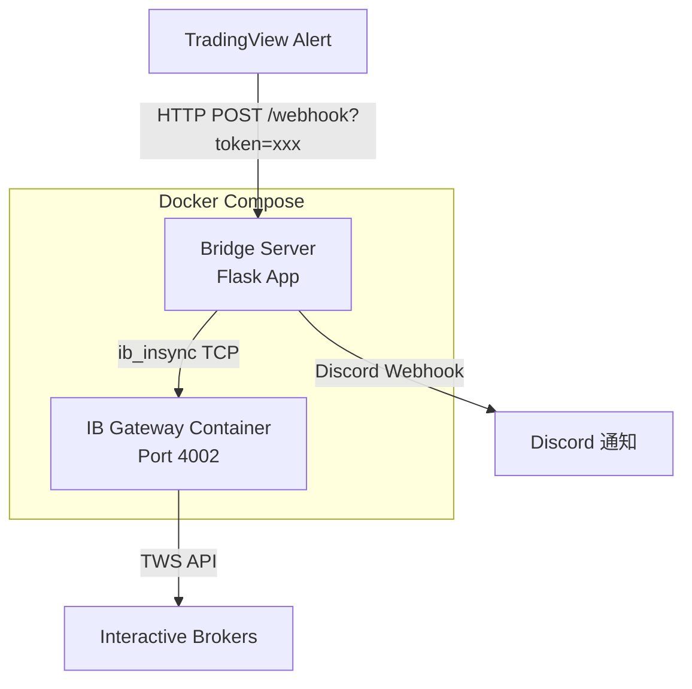

# TradingView-IBKR Bridge

接收 TradingView Webhook 交易訊號，透過 IB Gateway 自動執行 TQQQ 買賣的橋接服務。

## 架構



## 運作流程

1. TradingView 觸發 Alert，發送 JSON 至 `/webhook?token=xxx`
2. Bridge Server 驗證 token、解析訊號
3. 根據 `action` 執行進場（計算股數並買入）或出場（全部平倉）
4. 透過 Discord Webhook 推送交易結果通知

## 前置需求

- Docker & Docker Compose
- Interactive Brokers 帳號（支援 Paper Trading）
- TradingView 帳號（需支援 Webhook Alert）
- Discord Webhook URL（選用，用於通知）

## 本地開發

```bash
# 1. 複製環境變數範本
cp .env.example .env
# 編輯 .env 填入實際的 IB 帳號、密碼、Webhook Token 等

# 2. 啟動服務
docker compose up -d

# 3. 確認服務狀態
docker compose ps

# 4. 查看日誌
docker compose logs -f bridge
```

### 測試

```bash
# 安裝依賴
pip install -r requirements.txt

# 執行測試
pytest tests/ -v
```

### 手動測試 Webhook

```bash
curl -X POST "http://localhost:5000/webhook?token=your-secret-token-here" \
  -H "Content-Type: application/json" \
  -d '{
    "action": "entry",
    "ticker": "TQQQ",
    "direction": "long",
    "quantity_pct": 1.0,
    "price": 65.50,
    "timestamp": 1700000000,
    "signal_score": 0.85,
    "strategy_id": "tv-macd-cross"
  }'
```

## Zeabur 部署

### 步驟 1：建立專案

1. 登入 [Zeabur](https://zeabur.com) 控制台
2. 建立新專案，選擇適合的區域

### 步驟 2：部署服務

1. 在專案中選擇「從 GitHub 部署」，連結本倉庫
2. Zeabur 會自動偵測 `docker-compose.yml` 並建立兩個服務：
   - `bridge`：Flask 應用程式
   - `ib-gateway`：IB Gateway 容器

### 步驟 3：設定環境變數

在 Zeabur 控制台的「環境變數」頁面，設定以下變數：

| 變數名稱 | 必要 | 說明 |
|---------|------|------|
| `WEBHOOK_TOKEN` | ✅ | Webhook 驗證密鑰 |
| `IB_ACCOUNT` | ✅ | Interactive Brokers 帳號 |
| `IB_PASSWORD` | ✅ | Interactive Brokers 密碼 |
| `TRADING_MODE` | ✅ | `paper`（模擬）或 `live`（實盤） |
| `DISCORD_WEBHOOK_URL` | ❌ | Discord Webhook URL |
| `USE_EQUITY_PCT` | ❌ | 使用資產比例，預設 `0.95` |
| `IB_HOST` | ❌ | IB Gateway 主機，預設 `ib-gateway` |
| `IB_PORT` | ❌ | IB Gateway 連接埠，預設 `4002` |
| `IB_CLIENT_ID` | ❌ | IB API Client ID，預設 `1` |

### 步驟 4：設定網域

1. 在 Zeabur 為 `bridge` 服務綁定自訂網域或使用 Zeabur 提供的子網域
2. 記下完整 URL，格式為 `https://your-domain.zeabur.app`

### 步驟 5：驗證部署

```bash
# 確認服務運行中
curl https://your-domain.zeabur.app/webhook?token=your-token \
  -X POST -H "Content-Type: application/json" \
  -d '{"action":"entry","ticker":"TQQQ"}'
```

## TradingView Webhook 設定

### 建立 Alert

1. 在 TradingView 圖表上建立 Alert
2. 在「Notifications」分頁啟用「Webhook URL」
3. 填入 URL：`https://your-domain.zeabur.app/webhook?token=你的WEBHOOK_TOKEN`

### Alert Message（JSON 格式）

進場訊號：

```json
{
  "action": "entry",
  "ticker": "TQQQ",
  "direction": "long",
  "quantity_pct": 1.0,
  "price": {{close}},
  "timestamp": {{timenow}},
  "signal_score": 0.85,
  "strategy_id": "your-strategy-id"
}
```

出場訊號：

```json
{
  "action": "close",
  "ticker": "TQQQ",
  "direction": "long",
  "quantity_pct": 1.0,
  "price": {{close}},
  "timestamp": {{timenow}},
  "signal_score": 0.0,
  "strategy_id": "your-strategy-id"
}
```

> `{{close}}` 和 `{{timenow}}` 為 TradingView 內建變數，會自動替換為當前收盤價與時間戳。

## 環境變數參考

| 變數名稱 | 類型 | 必要 | 預設值 | 用途 | 使用者 |
|---------|------|------|--------|------|--------|
| `WEBHOOK_TOKEN` | str | ✅ | — | Webhook 請求驗證密鑰 | Bridge Server |
| `IB_ACCOUNT` | str | ✅ | — | IB 登入帳號 | IB Gateway |
| `IB_PASSWORD` | str | ✅ | — | IB 登入密碼 | IB Gateway |
| `TRADING_MODE` | str | ✅ | — | `paper` 或 `live` | IB Gateway |
| `DISCORD_WEBHOOK_URL` | str | ❌ | `None` | Discord 通知 URL | Bridge Server |
| `USE_EQUITY_PCT` | float | ❌ | `0.95` | 使用帳戶資產比例 | Bridge Server |
| `IB_HOST` | str | ❌ | `ib-gateway` | IB Gateway 主機位址 | Bridge Server |
| `IB_PORT` | int | ❌ | `4002` | IB Gateway 連接埠 | Bridge Server |
| `IB_CLIENT_ID` | int | ❌ | `1` | IB API Client ID | Bridge Server |
